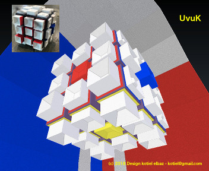

# UvuK Cube

<p align="center" >
  
</p>

## Qu’est-ce l’UvuK Cube?

La capacité de l’esprit à anticiper un parcours 3D d'une position A vers une position B dans l’espace 3D s'apprend.
**UvuK** vous permet d’imaginer ce parcours en 3D (Troisième Dimension), par la sensitivité tactile du bout des doigts, et avec l'aide des cubignons **PiK** et **LaK**.


## What is the UvuK Cube?

Imagine you could improve your mind path 3D modeler to move objects around in 3D space.

**UvuK** allows you to imagine a 3D path and execute it, even if you were visually impaired - with your fingers tips, thanks to the cubignons **PiK** and **LaK**.

License Creative Commons (BY) (SA) (NC)


``` bash
Email uvukcube@gmail.com
Instagram @uvukcube #uvukcube

Bon Courage, 2018, June 1st
> K.
```
